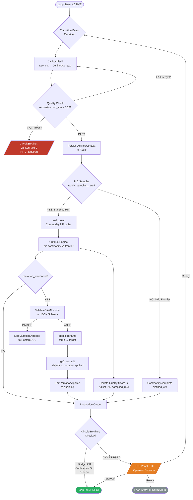

This is a pure technical architecture response — no file creation skill needed. Let me produce the full specification directly.

---

# `ail` — Alexander's Impressive Loops: Technical Architecture

---

## Phase 1: System Identity & Constraint Model

`ail` is a **deterministic orchestration kernel** whose invariant is: *all stochasticity is quarantined inside child process boundaries*. The kernel itself must be referentially transparent across identical inputs — given the same loop state and configuration, it must produce the same scheduling decisions. This is the foundational separation of concerns.

**Topology:**

```
┌─────────────────────────────────────────────────────┐
│                   ail (Rust Binary)                  │
│  ┌──────────┐  ┌──────────┐  ┌────────────────────┐ │
│  │  TUI     │  │  Kernel  │  │  PTY Process Mgr   │ │
│  │ (Ratatui)│◄►│(Orchestr)│◄►│ (portable-pty)     │ │
│  └──────────┘  └────┬─────┘  └────────────────────┘ │
│                     │                                │
│            ┌────────▼────────┐                       │
│            │  Port Adapters  │                       │
│            │ Redis│PG│Proxy  │                       │
└────────────┴────────────────┴───────────────────────┘
         docker-compose network: ail_internal
```

**15-Factor compliance summary:**
- Factor III (Config): All thresholds, model endpoints, budget gates via env vars — never compiled in.
- Factor VI (Stateless): The Rust binary carries zero heap state across loop boundaries. All state is externalized to Redis (ephemeral) and PostgreSQL (durable).
- Factor XI (Logs): Structured JSON to stdout only. No file appenders in-process.
- Factor XV (Observability): Every loop transition emits a `TraceEvent` with span ID traceable through the proxy.

---

## Phase 2: Module Specifications

### 2.1 PTY-Managed Interaction Layer

**The Core Problem:** `portable-pty` gives you a `Box<dyn MasterPty>` and a child process wired to a slave PTY. Reads from the master are *blocking* by default. Naïvely calling `read()` on the master in an async context will park a tokio thread permanently, starving the executor.

**Solution: Dedicated Blocking Thread + Channel Bridge**

```rust
// The PTY master reader MUST run on a blocking thread.
// tokio::task::spawn_blocking is insufficient here because 
// PTY reads can block indefinitely — use a raw OS thread.

pub struct PtySession {
    master: Box<dyn MasterPty + Send>,
    writer: Box<dyn Write + Send>,
    // Channel from blocking reader thread → async consumers
    output_tx: mpsc::Sender<PtyEvent>,
    // Channel from async kernel → blocking writer thread
    input_rx: mpsc::Receiver<PtyInput>,
}

#[derive(Debug)]
pub enum PtyEvent {
    Output(Bytes),
    PromptDetected(InteractivePrompt),
    ProcessExited(ExitStatus),
}

#[derive(Debug)]
pub enum InteractivePrompt {
    SudoPassword,
    GitCredential { realm: String },
    YesNo { question: String },
    Arbitrary { raw: String },
}
```

**Prompt Detection Logic:**

The blocking reader thread runs a state machine over raw bytes. It does NOT attempt line-buffering (PTY output is not newline-delimited in all cases). Instead it maintains a rolling 512-byte window and applies ordered regex matchers:

```rust
// Evaluated in priority order — first match wins
static PROMPT_PATTERNS: LazyLock<Vec<(Regex, PromptKind)>> = LazyLock::new(|| vec![
    (Regex::new(r"\[sudo\] password for \w+:\s*$").unwrap(), PromptKind::Sudo),
    (Regex::new(r"Username for '([^']+)':\s*$").unwrap(), PromptKind::GitUser),
    (Regex::new(r"Password for '([^']+)':\s*$").unwrap(), PromptKind::GitPassword),
    (Regex::new(r"\(y/n\)\s*[\?\:]\s*$").unwrap(),        PromptKind::YesNo),
    (Regex::new(r"(?i)continue\s*\?\s*$").unwrap(),        PromptKind::YesNo),
]);
```

**Bubble-Up Protocol (non-blocking):**

When a `PromptDetected` event arrives in the async layer, the kernel suspends the current loop stage (does NOT block the tokio executor) and routes the event to the TUI via a separate `tui_event_tx: mpsc::Sender<TuiDirective>`. The TUI renders a modal overlay. User input returns via `tui_input_rx` and is forwarded to the PTY writer. This entire handoff is async and zero-copy.

**Critical invariant:** The blocking thread must never hold a `tokio::sync` primitive. Use `std::sync::mpsc` for the bridge, then re-enter tokio-land via `tx.blocking_send()` — which is the correct API for blocking→async boundary crossing.

---

### 2.2 The "Janitor" Memory Protocol

**Constraint:** Between every state transition, context must be distilled. This is not optional compression — it is a hard gate. A transition that skips distillation is a protocol violation, enforced at the type level.

**The Token Accounting Model:**

Define a `ContextBudget` that is computed from the target model's context window, not from the current context size:

```
distillation_target_tokens = min(
    floor(next_model_context_window * 0.08),  // 8% ceiling
    512  // absolute floor for safety margin
)
```

The 90% reduction target follows: if the working context is 6,000 tokens (typical for a mid-loop agentic state), the Janitor must produce ≤512 tokens of "load-bearing" residue.

**What is "load-bearing"?** Operationally defined as the minimal information set that allows the next reasoning turn to produce a decision *equivalent* to one it would have produced with full context. This is formalized as a distillation prompt with explicit extraction categories:

```
JANITOR SYSTEM PROMPT (immutable, version-locked in YAML):
Extract ONLY the following, in order of precedence:
1. OBJECTIVES: The 1-3 active goals with completion criteria
2. CONSTRAINTS: Hard constraints that must not be violated  
3. LAST_DECISION: The final action taken and its outcome
4. OPEN_QUESTIONS: Unresolved blockers requiring next-turn attention
5. ARTIFACTS: File paths / identifiers modified (no content)
Omit rationale, history, intermediate steps, and all prose.
Output: structured YAML only. Max 500 tokens.
```

**Type-Level Enforcement:**

```rust
/// A `DistilledContext` can only be constructed by the Janitor.
/// It cannot be Default::default()'d or constructed outside this module.
pub struct DistilledContext {
    objectives: Vec<Objective>,
    constraints: Vec<Constraint>,
    last_decision: Decision,
    open_questions: Vec<String>,
    artifact_refs: Vec<ArtifactRef>,
    token_count: u32,
    distilled_at: DateTime<Utc>,
}

/// State transitions require proof of distillation.
pub fn transition(
    from: LoopState,
    ctx: DistilledContext,  // ← can't be faked
    event: TransitionEvent,
) -> Result<LoopState, OrchestratorError> { ... }
```

**Quality Verification:** After distillation, a secondary "reconstruction challenge" prompt is sent (to a cheap model, not the frontier): *"Given only this context, what was the last concrete action taken and why?"* If the answer diverges from the ground-truth decision log by cosine similarity < 0.85 (embeddings stored in Redis), the Janitor retries up to 2× before escalating a `JanitorFailure` circuit breaker event.

---

### 2.3 Recursive Meta-Learning Engine

**Architecture: Parallel Critique with PID-Controlled Sampling**

The key insight is that the PID controller is not controlling output quality directly — it is controlling the *sampling rate* of the critique pipeline to manage cost while maintaining learning signal density.

```
Quality Score S ∈ [0.0, 1.0]:
  S = w₁·task_success + w₂·token_efficiency + w₃·critique_alignment
  weights: [0.5, 0.2, 0.3]  (configurable in YAML, git-tracked)

PID Controller:
  error(t) = S_target - S(t)   // S_target = 0.75 by default
  sampling_rate(t) = Kp·e(t) + Ki·∫e dt + Kd·de/dt
  sampling_rate clamped to [0.02, 1.0]  // never fully disable learning
```

When `sampling_rate` is low (S is high, things are working), the meta-learning loop runs infrequently — saving cost. When S degrades, sampling_rate increases, generating more critique data to recover.

**Parallel Prompt Execution:**

```rust
pub async fn parallel_refinement_run(
    kernel: &dyn Orchestrator,
    ctx: &DistilledContext,
    commodity: &dyn ModelProvider,
    frontier: &dyn ModelProvider,
    sampling_rate: f64,
) -> RefinementResult {
    // Commodity always runs — it's the production path
    let commodity_fut = commodity.complete(ctx.to_prompt());
    
    // Frontier runs only when sampled
    let frontier_fut = async {
        if rand::random::<f64>() < sampling_rate {
            Some(frontier.complete(ctx.to_prompt()).await)
        } else {
            None
        }
    };
    
    let (commodity_out, frontier_out) = tokio::join!(commodity_fut, frontier_fut);
    
    // Critique only when both ran
    if let Some(frontier_response) = frontier_out {
        let critique = run_critique(commodity_out, frontier_response).await;
        update_quality_score(&critique).await;
        if critique.mutation_warranted() {
            schedule_yaml_mutation(critique).await;
        }
    }
    
    RefinementResult { output: commodity_out, ... }
}
```

**Atomic YAML Mutation Protocol:**

Mutations to prompts/config are never applied in-process. The mutation engine:
1. Reads the current YAML file
2. Applies the proposed change to an in-memory clone
3. Validates the clone against a JSON Schema
4. Writes to a temp file in the same directory (same filesystem — atomic rename guaranteed)
5. `rename(temp, target)` — atomic on POSIX
6. Commits via `git2` crate: `git add <file> && git commit -m "ail/janitor: mutation <hash> applied"`
7. Emits a `MutationApplied` event to the audit log

If the git commit fails (dirty tree, conflict), the mutation is rolled back via `rename(target, temp)` and logged as `MutationDeferred`.

---

### 2.4 Observability & HITL

**Proxy Deep Inspection:**

LiteLLM/Bifrost operates as an HTTP reverse proxy. To inspect raw metadata including provider-injected headers and latent filter signals, `ail` does not trust the proxy's SDK abstractions. Instead, it instruments at the HTTP client level using a `tower::Layer` middleware on the `reqwest`-based client:

```rust
pub struct ProbeLayer;

impl<S> Layer<S> for ProbeLayer {
    type Service = ProbeService<S>;
    fn layer(&self, inner: S) -> Self::Service {
        ProbeService { inner }
    }
}

// Captures: x-ratelimit-*, x-content-filter-*, cf-ray, x-request-id
// Emits to: Redis stream "ail:http:metadata" with TTL 1h
async fn probe_response(resp: &Response) -> ProbeMetadata {
    ProbeMetadata {
        status: resp.status(),
        provider_filter_triggered: resp.headers()
            .get("x-content-filter-result")
            .map(|v| v != "pass"),
        rate_limit_remaining: parse_header(resp, "x-ratelimit-remaining-requests"),
        latency_ms: ...,
        trace_id: resp.headers().get("x-request-id").cloned(),
    }
}
```

**Circuit Breaker Design:**

Three independent circuit breakers, each implemented as a `tokio::sync::watch` channel (not a mutex — readers never block writers):

```rust
pub enum CircuitBreakerKind {
    ConfidenceBreach { score: f32, threshold: f32 },
    BudgetGate { spent_usd: Decimal, limit_usd: Decimal },
    HighRiskCommand { command: String, risk_level: RiskLevel },
}

pub struct CircuitBreaker {
    state: watch::Sender<BreakerState>,
    kind: CircuitBreakerKind,
}

#[derive(Clone, PartialEq)]
pub enum BreakerState {
    Closed,       // normal operation
    HalfOpen,     // HITL required before proceeding
    Open,         // hard stop, human must reset
}
```

HITL is non-blocking: when a breaker trips to `HalfOpen`, the kernel suspends *that loop's execution* but continues processing events from other loops (if running concurrently). The TUI renders a `HumanDecisionRequired` panel. The operator's response (`Approve | Reject | Modify`) is written back to a Redis key, which a `watch::Receiver` in the kernel detects — no polling.

**Budget Gate Implementation:**

```rust
// Redis atomic increment — no double-spend risk
async fn record_spend(redis: &mut Connection, loop_id: Uuid, usd: Decimal) -> Decimal {
    let key = format!("ail:budget:{loop_id}");
    let total: String = redis.incrbyfloat(&key, usd.to_f64().unwrap()).await?;
    total.parse().unwrap()
}

// Called after every ModelProvider invocation, before state transition
if total_spent > budget_limit {
    circuit_breakers.budget.trip(BudgetGate { spent_usd: total_spent, limit_usd: budget_limit });
    return Err(OrchestratorError::BudgetExceeded);
}
```

---

## Phase 3: DDD & SOLID Implementation

### Trait Definitions (Rust Blueprint)

```rust
// ============================================================
// PORTS (interfaces) — defined in the domain crate
// ============================================================

/// Core model interaction port. Implementations are adapters.
#[async_trait]
pub trait ModelProvider: Send + Sync + 'static {
    /// Unique identifier for logging and cost attribution
    fn provider_id(&self) -> &'static str;
    
    /// Model tier for routing decisions
    fn tier(&self) -> ModelTier;
    
    /// Cost per 1K tokens (input, output) in USD
    fn cost_profile(&self) -> CostProfile;
    
    /// Execute a completion. Returns structured output + metadata.
    async fn complete(
        &self,
        prompt: Prompt,
        options: CompletionOptions,
    ) -> Result<Completion, ProviderError>;
    
    /// Check provider health without consuming quota
    async fn health_check(&self) -> HealthStatus;
}

#[derive(Debug, Clone, PartialEq)]
pub enum ModelTier { Commodity, Frontier }

pub struct CostProfile {
    pub input_per_1k_tokens: Decimal,
    pub output_per_1k_tokens: Decimal,
}

pub struct Completion {
    pub content: String,
    pub usage: TokenUsage,
    pub probe_metadata: ProbeMetadata,
    pub finish_reason: FinishReason,
}

// ============================================================

/// Context lifecycle management port.
#[async_trait]
pub trait ContextManager: Send + Sync + 'static {
    /// Load the current distilled context for a loop from backing store
    async fn load(&self, loop_id: Uuid) -> Result<Option<DistilledContext>, ContextError>;
    
    /// Persist distilled context. Overwrites previous.
    async fn persist(&self, loop_id: Uuid, ctx: &DistilledContext) -> Result<(), ContextError>;
    
    /// Distill raw working context into load-bearing residue.
    /// This is the Janitor's core operation.
    async fn distill(
        &self,
        raw: &WorkingContext,
        target_tokens: u32,
    ) -> Result<DistilledContext, JanitorError>;
    
    /// Verify distillation quality via reconstruction challenge.
    async fn verify_distillation(
        &self,
        original: &WorkingContext,
        distilled: &DistilledContext,
    ) -> Result<DistillationQuality, JanitorError>;
    
    /// Evict expired context (called by background task, not hot path)
    async fn evict_expired(&self) -> Result<u64, ContextError>;
}

pub struct DistillationQuality {
    pub reconstruction_similarity: f32,  // cosine similarity [0,1]
    pub token_reduction_ratio: f32,      // should be >0.90
    pub passed: bool,
}

// ============================================================

/// The Orchestrator AggregateRoot — owns the loop lifecycle.
#[async_trait]
pub trait Orchestrator: Send + Sync + 'static {
    async fn start_loop(&self, spec: LoopSpec) -> Result<LoopId, OrchestratorError>;
    async fn advance(&self, loop_id: LoopId, event: TransitionEvent) -> Result<LoopState, OrchestratorError>;
    async fn suspend(&self, loop_id: LoopId, reason: SuspendReason) -> Result<(), OrchestratorError>;
    async fn terminate(&self, loop_id: LoopId, outcome: LoopOutcome) -> Result<AuditRecord, OrchestratorError>;
    async fn state(&self, loop_id: LoopId) -> Result<LoopState, OrchestratorError>;
}

// ============================================================
// ADAPTERS (implementations) — in infrastructure crate
// ============================================================

pub struct LiteLlmAdapter {
    client: reqwest::Client,  // with ProbeLayer tower middleware
    base_url: Url,
    model_name: String,
    tier: ModelTier,
    cost_profile: CostProfile,
}

#[async_trait]
impl ModelProvider for LiteLlmAdapter { ... }

pub struct RedisContextManager {
    pool: deadpool_redis::Pool,
    distillation_provider: Arc<dyn ModelProvider>,
    critique_provider: Arc<dyn ModelProvider>,
}

#[async_trait]
impl ContextManager for RedisContextManager { ... }
```

**Dependency Injection Pattern:**

`ail` uses constructor injection exclusively. There is no service locator, no global registry. The composition root is in `main.rs` and is the *only* place that names concrete types:

```rust
// main.rs — composition root
#[tokio::main]
async fn main() -> Result<()> {
    let cfg = Config::from_env()?;  // Factor III
    
    let commodity = Arc::new(LiteLlmAdapter::new(&cfg.commodity_model));
    let frontier  = Arc::new(LiteLlmAdapter::new(&cfg.frontier_model));
    let redis_pool = build_redis_pool(&cfg.redis_url).await?;
    let pg_pool    = build_pg_pool(&cfg.database_url).await?;
    
    let ctx_manager: Arc<dyn ContextManager> = Arc::new(
        RedisContextManager::new(redis_pool.clone(), commodity.clone(), frontier.clone())
    );
    
    let orchestrator: Arc<dyn Orchestrator> = Arc::new(
        KernelOrchestrator::new(commodity, frontier, ctx_manager, pg_pool)
    );
    
    // TUI and PTY layers receive Arc<dyn Orchestrator> — they never see concrete types
    run_tui(orchestrator).await
}
```

This means swapping PostgreSQL for SQLite (for local dev) requires changing exactly one line in `main.rs`.

---

## Phase 4: Deliverables

### 4.1 Architecture Diagram



### 4.2 API/Contract: Kernel ↔ TUI ↔ Proxy

**Kernel → TUI (via `tokio::sync::mpsc`):**

```rust
pub enum TuiDirective {
    LoopStateUpdate { loop_id: Uuid, state: LoopState },
    PtyOutput { session_id: Uuid, data: Bytes },
    PromptRequired { session_id: Uuid, prompt: InteractivePrompt },
    HitlRequired { breaker: CircuitBreakerKind, context: HitlContext },
    BudgetUpdate { loop_id: Uuid, spent_usd: Decimal, limit_usd: Decimal },
    MutationApplied { file: PathBuf, summary: String },
    MetricsSnapshot { s_score: f32, sampling_rate: f64, tokens_saved: u64 },
}
```

**TUI → Kernel (via `tokio::sync::mpsc`):**

```rust
pub enum KernelCommand {
    PtyInput { session_id: Uuid, data: Bytes },
    HitlDecision { loop_id: Uuid, decision: HitlDecision },
    SuspendLoop { loop_id: Uuid },
    TerminateLoop { loop_id: Uuid },
    AdjustBudgetLimit { loop_id: Uuid, new_limit_usd: Decimal },
}

pub enum HitlDecision { Approve, Reject, Modify(ModifyPayload) }
```

**Kernel → Proxy (HTTP, via tower-instrumented reqwest):**

All requests carry:
```
X-AIL-Loop-ID: <uuid>
X-AIL-Span-ID: <uuid>          // for distributed tracing
X-AIL-Model-Tier: commodity|frontier
X-AIL-Budget-Remaining: <decimal>
```

All responses are inspected for:
```
X-Content-Filter-Result → ProviderFilterTriggered event
X-Ratelimit-Remaining-* → RateLimitProbe event  
X-Request-ID           → correlated to TraceEvent in PostgreSQL
```

### 4.3 State Machine Formalization

```rust
#[derive(Debug, Clone, PartialEq, Eq, Hash)]
pub enum LoopState {
    Initializing,
    Distilling,          // Janitor active
    Running,             // commodity model active
    Sampling,            // both models active (PID triggered)
    Critiquing,          // post-run analysis
    Mutating,            // YAML mutation in progress
    HitlPending(HitlReason), // waiting for human
    Suspended,
    Completed(LoopOutcome),
}

// Valid transitions are encoded in the type system.
// Invalid transitions return Err — they cannot panic.
impl LoopState {
    pub fn can_transition_to(&self, next: &LoopState) -> bool {
        matches!((self, next),
            (Initializing, Distilling) |
            (Distilling, Running) |
            (Distilling, HitlPending(_)) |
            (Running, Critiquing) |
            (Running, HitlPending(_)) |
            (Sampling, Critiquing) |
            (Critiquing, Mutating) |
            (Critiquing, Distilling) |
            (Mutating, Distilling) |
            (HitlPending(_), Running) |
            (HitlPending(_), Suspended) |
            (HitlPending(_), Completed(_)) |
            (_, Suspended) |
            (_, Completed(_))
        )
    }
}
```

---

## Phase 4.4: Risk Assessment

### Risk 1: Feedback Loop Hallucination (Mutation Drift)

**Failure Mode:** The meta-learning engine's PID controller drives sampling_rate high due to a transient quality dip. The frontier model, operating on a distilled context, produces a "better-looking" response that is actually hallucinated. The critique engine scores it highly. The YAML mutation encodes the hallucinated pattern into the system prompt. Quality Score S temporarily rises (the mutated prompt produces confident-sounding output), the PID reduces sampling rate, and the mutation is now locked in with no correction signal.

**Mitigation — Three-Layer Defense:**
1. **Mutation Quarantine Period:** Every YAML mutation is tagged with a `quarantine_until` timestamp (default: 24h or 50 loops, whichever is longer). During quarantine, the PID sampling rate cannot fall below 0.5 — forcing continued critique regardless of S score.
2. **Ground-Truth Anchoring:** 5% of all runs (PID-independent) are compared against a fixed "golden prompt" baseline stored in PostgreSQL at project init. If the delta between current output and golden output exceeds a threshold, a `BaselineDivergence` alarm fires.
3. **Mutation Rollback Trigger:** If S degrades by >0.15 within 10 loops of a mutation, `git2::Repository::reset(HEAD~1, ResetType::Hard)` is called automatically and the mutation is blacklisted in PostgreSQL.

---

### Risk 2: PTY Prompt Detection False Negative (Silent Hang)

**Failure Mode:** A child binary issues an interactive prompt that doesn't match any pattern in `PROMPT_PATTERNS` (e.g., a novel tool with non-standard prompt formatting). The blocking reader thread is stuck in `read()`. No `PromptDetected` event fires. The kernel's loop advances timer reaches its timeout, fires a `StageTimeout` circuit breaker, and terminates the PTY session — but the child process is now an orphan consuming resources and potentially holding file locks.

**Mitigation:**
1. **Idle Byte Detection:** The blocking reader tracks `last_byte_received_at`. If no bytes arrive for `pty_idle_timeout` (default: 30s, configurable), it emits a `PtyIdle` event even without pattern match. The kernel treats this as "possible unknown prompt" and routes to HITL with the raw tail bytes displayed.
2. **Explicit Orphan Reaping:** On `PtySession::drop`, the session always sends `SIGTERM` to the process group (not just the direct child) via `nix::sys::signal::killpg`. After 5s, `SIGKILL`. This is enforced via a `scopeguard` that runs even if the drop occurs during a panic unwind.
3. **Pattern Registry Mutation:** Unknown prompts that were resolved via HITL are candidates for the mutation engine — the operator's resolution is logged, and the Janitor can propose a new `PROMPT_PATTERNS` entry via the YAML mutation pipeline.

---

### Risk 3: Redis State Corruption on Split-Brain (Network Partition)

**Failure Mode:** The Rust kernel and Redis are in the same docker-compose network, but a transient network partition causes a Redis write to succeed on the server but the ACK to be lost in transit. The kernel retries, writing a second `DistilledContext` to the same key. Redis's last-write-wins semantics mean the retry (potentially with a slightly different distillation result due to LLM stochasticity) overwrites the first. The loop now operates on a context with an inconsistent distillation — neither the first nor second is the canonical result.

**Mitigation:**
1. **Optimistic Locking via Redis WATCH/MULTI/EXEC:** Every context write uses a transaction: `WATCH <key>`, read current version, compute next version, `MULTI`, set with version increment, `EXEC`. If `EXEC` returns nil (another writer modified the key), the write is aborted and surfaced as `ContextConflict` — never silently retried with potentially different content.
2. **Write Idempotency via Content Hash:** The `DistilledContext` is serialized to canonical CBOR and SHA-256 hashed. The Redis key stores `{hash, content}`. On retry, if the hash already exists, the write is a no-op — idempotent by content, not by timestamp.
3. **PostgreSQL as Source of Truth:** Redis is a *cache*, not a database. The authoritative context record is written to PostgreSQL (with `RETURNING id`) *before* the Redis write. If Redis is unavailable, the kernel falls back to PostgreSQL reads with a latency warning metric emitted. PostgreSQL writes use explicit transactions with `SERIALIZABLE` isolation on the audit table.

---

## Summary: Structural Integrity Checklist

| Property | Mechanism | Enforced By |
|---|---|---|
| Deterministic kernel | No mutable global state | Rust borrow checker + `Send+Sync` bounds |
| Distillation mandatory | `DistilledContext` unconstructable outside Janitor | Rust module privacy |
| Budget never exceeded | Atomic Redis increment before state advance | `record_spend()` called in middleware |
| Mutations reversible | `git2` commit + quarantine period | `MutationApplied` audit log |
| PTY never orphaned | `scopeguard` drop + process group kill | RAII pattern |
| State machine exhaustive | `can_transition_to()` + `matches!` coverage | Compiler warnings on non-exhaustive |
| Config never compiled in | `Config::from_env()` at composition root | Factor III, no `const` model names |